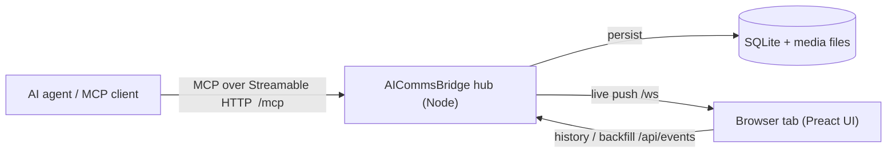

# AICommsBridge

A local, MCP-driven **progress feed**. Start the hub once, keep a single browser tab open, and let an AI agent push screenshots, markdown notes, progress cards, code, diffs, links, and live log streams to one place — so you watch progress without juggling windows.

- **One-way display in v1**, structured so an ask-and-wait layer can be added later without a rewrite.
- **Persistent**: a scrollable history that survives hub and tab restarts (SQLite + on-disk media).
- **Standards-compliant MCP**: any Streamable-HTTP MCP client can drive it.

## How it works



Each tool call follows the same path: **validate → persist (SQLite / media) → broadcast (WebSocket)**. The browser is a pure consumer — it loads history over REST and receives live updates over WebSocket, reconnecting and back-filling automatically.

## Requirements

- **Node.js 22.18.0** (pinned in [`.tool-versions`](./.tool-versions); use `asdf`/`fnm`/`nvm` or any Node ≥ 22.18).
- npm (ships with Node).
- macOS/Linux. `better-sqlite3` is a native module and is built on `npm install`.

> Prefer containers? You can skip the Node toolchain entirely and [run it with Docker](#run-with-docker).

## Quick start

```bash
git clone https://github.com/Lithial/AICommsBridge.git
cd AICommsBridge
npm install

# Build the browser UI bundle (required — the hub serves it as static files)
npm run build:web

# Start the hub
npm run start:dev          # http://127.0.0.1:4500
```

Then open **http://127.0.0.1:4500** in a browser and leave the tab open. Point your MCP client at **http://127.0.0.1:4500/mcp** (see [Connecting an MCP client](#connecting-an-mcp-client)).

### Production run

`start:dev` runs the TypeScript entry directly via `tsx`. For a compiled run:

```bash
npm run build              # builds the UI bundle + compiles the server to dist/
npm start                  # node dist/index.js
```

## Run with Docker

The repo ships a multi-stage [`Dockerfile`](./Dockerfile) and a [`docker-compose.yml`](./docker-compose.yml). The image builds the UI bundle, compiles the server, and runs it as a non-root user; data lives in a `/data` volume so your history survives container restarts.

```bash
docker compose up -d            # build the image + start in the background
# UI now at http://127.0.0.1:4500  (MCP endpoint: /mcp)
docker compose logs -f          # follow logs
docker compose down             # stop; the aicb-data volume keeps your history
```

Or without Compose:

```bash
docker build -t aicommsbridge .
docker run -d --name aicommsbridge \
  -p 127.0.0.1:4500:4500 \
  -v aicb-data:/data \
  aicommsbridge
```

The image sets `AICB_HOST=0.0.0.0` (so the port is reachable through Docker's mapping), `AICB_PORT=4500`, and `AICB_DATA_DIR=/data`. The published port is bound to the host's `127.0.0.1` because the hub has **no authentication** — only widen this (e.g. `-p 4500:4500`) if you understand the exposure. Point your MCP client at `http://127.0.0.1:4500/mcp`.

## Configuration

All configuration is via environment variables; defaults work out of the box.

| Variable         | Default            | Description                                              |
| ---------------- | ------------------ | -------------------------------------------------------- |
| `AICB_HOST`      | `127.0.0.1`        | Network interface to bind. `127.0.0.1` = local only; `0.0.0.0` listens on all interfaces (set by the Docker image). |
| `AICB_PORT`      | `4500`             | Port the hub listens on.                                 |
| `AICB_DATA_DIR`  | `~/.aicommsbridge` | Where data is stored: `db.sqlite` + `media/` (uploads).  |

```bash
AICB_PORT=5000 AICB_DATA_DIR=/tmp/acb npm run start:dev
```

Data persists across restarts. Clear the feed at any time with the **Clear** button in the UI topbar or the `clear_feed` MCP tool. To wipe everything including media off disk, stop the hub and delete `$AICB_DATA_DIR`.

## MCP tools

The hub exposes **8 tools** over MCP. Every tool also accepts an optional `channel` string (defaults to `"default"`) — the UI shows a single feed today, but every event is keyed by channel so multi-channel views can be added later.

| Tool              | Required          | Optional                                                  | Notes |
| ----------------- | ----------------- | --------------------------------------------------------- | ----- |
| `show_image`      | —                 | `path` *or* `data`+`mimeType`, `caption`                  | Provide a local file `path` **or** base64 `data` with its `mimeType`. |
| `post_note`       | `markdown`        | `level`, `title`                                          | `level` ∈ `info` \| `important` \| `success` \| `warn` \| `error`. `important`/`warn`/`error` stand out and trigger a notification. |
| `update_progress` | `key`, `label`    | `percent` (0–100), `status`                               | **Upsert by `key`** — re-call with the same key to update the card in place. `status` ∈ `active` \| `done` \| `error`. |
| `show_code`       | `code`            | `language`, `filename`, `caption`                         | Syntax-highlighted snippet. |
| `show_diff`       | —                 | `diff` *or* `before`+`after`, `filename`, `language`      | Pass a unified `diff` string **or** `before`/`after` text (the hub computes the diff). |
| `add_link`        | `url`             | `title`, `description`                                    | `url` must be a valid URL. Renders a clickable card. |
| `append_log`      | `key`, `text`     | `title`                                                   | **Append by `key`** — re-call to keep appending to one stream (capped at the most recent 1000 lines). |
| `clear_feed`      | —                 | `channel`                                                 | **Destructive** — permanently deletes cards (and their media). Omit `channel` to clear the whole bridge; pass one to clear just that channel. |

## Connecting an MCP client

Any Streamable-HTTP MCP client works. The repo ships a project-scoped [`.mcp.json`](./.mcp.json) that registers the hub for clients that read it (e.g. Claude Code):

```json
{
  "mcpServers": {
    "aicommsbridge": {
      "type": "http",
      "url": "http://127.0.0.1:4500/mcp"
    }
  }
}
```

Or drive it programmatically with the official TypeScript SDK:

```js
import { Client } from "@modelcontextprotocol/sdk/client/index.js";
import { StreamableHTTPClientTransport } from "@modelcontextprotocol/sdk/client/streamableHttp.js";

const client = new Client({ name: "my-agent", version: "1.0.0" });
await client.connect(
  new StreamableHTTPClientTransport(new URL("http://127.0.0.1:4500/mcp")),
);

await client.callTool({
  name: "post_note",
  arguments: { title: "Build", markdown: "Tests **green** ✅", level: "success" },
});
await client.callTool({
  name: "update_progress",
  arguments: { key: "deploy", label: "Deploying", percent: 60, status: "active" },
});

await client.close();
```

The cards appear in the open browser tab instantly.

## HTTP & WebSocket endpoints

| Endpoint              | Purpose                                                            |
| --------------------- | ----------------------------------------------------------------- |
| `GET /`               | The web UI (served from the built `web/dist` bundle).             |
| `POST /mcp`           | MCP endpoint (Streamable HTTP transport).                         |
| `GET /api/events`     | Event history; `?after=<id>` returns only events after that id.   |
| `DELETE /api/events`  | Clears the feed (the UI **Clear** button); `?channel=<id>` scopes it. Returns `{ deleted }`. |
| `GET /media/:id`      | Serves an uploaded image by media id.                             |
| `GET /ws`             | WebSocket for live messages: `{ kind: "created" \| "updated", event }` or `{ kind: "cleared", channelId? }`. |

## Development

| Script                   | What it does                                            |
| ------------------------ | ------------------------------------------------------- |
| `npm run start:dev`      | Run the hub via `tsx` (no compile step).                |
| `npm run dev:hub`        | Same, with watch/restart on change.                     |
| `npm run dev:web`        | Vite dev server for the UI (hot reload).                |
| `npm run build`          | Build UI bundle **and** compile the server to `dist/`.  |
| `npm test`               | Server test suite (Vitest).                             |
| `npm run test:web`       | Web test suite (Vitest + jsdom).                        |
| `npm run test:all`       | Both suites.                                            |
| `npm run typecheck`      | Type-check the server.                                  |
| `npm run typecheck:web`  | Type-check the web app.                                 |

### Project layout

```
src/
  index.ts            # entry: wires HTTP + WS + MCP and starts the hub
  config.ts           # env-driven config (port, data dir)
  domain/events.ts    # single source of truth: event types + zod schemas
  store/              # SQLite (events, media) — append, cursor query, upsert, log cap
  realtime/           # WebSocket broadcaster + throttle
  http/               # Express app: static UI, /api/events, /media
  mcp/server.ts       # the 7 MCP tools
  feed.ts             # FeedService: validate → persist → broadcast
web/
  src/                # Vite + Preact UI (feed, cards, renderers, WS client)
  dist/               # built bundle the hub serves (created by build:web)
```

## Tech stack

- **Hub**: Node 22 · TypeScript (NodeNext ESM) · `@modelcontextprotocol/sdk` (Streamable HTTP) · Express · `ws` · `better-sqlite3` (WAL) · `zod` · `diff` · `image-size`.
- **Web**: Vite · Preact · `marked` + `dompurify` (notes) · `highlight.js` (code) — pure WebSocket consumer.
- **Tests**: Vitest (+ `supertest` for HTTP, jsdom + `@testing-library/preact` for the UI).
