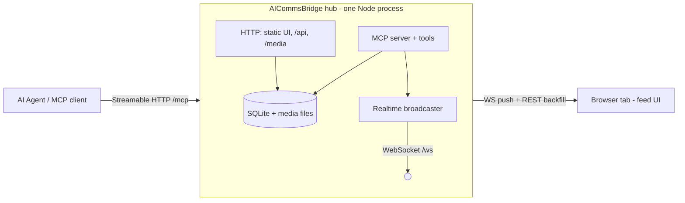

# AICommsBridge — MCP-Driven Progress Feed

- **Date:** 2026-06-17
- **Status:** Draft (awaiting user review)
- **Topic:** A local, MCP-driven progress feed that lets an AI agent push screenshots, notes, progress, code/diffs, links, and logs to a single browser tab the user keeps open.

## 1. Goal

Give an AI agent one place to *show* the user what it is doing — screenshots, important notes, live progress, code/diffs, links, and log streams — so the user watches a single browser tab instead of opening and polling many windows.

**Demoable success:** With the hub running and the tab open, an agent calls each MCP tool once and the user sees, live and without reloading: an image with a caption, a rendered markdown note, a progress card that advances in place, a syntax-highlighted code block, a unified diff, a link card, and a log stream that grows. After restarting the hub and reloading the tab, the full history is still there.

## 2. Decisions captured (from brainstorming)

| Question | Decision |
|---|---|
| Viewing surface | Local web app in a browser tab |
| Channel direction | One-way display now; structured so two-way (ask-and-wait) layers in later |
| v1 content types | image, note (markdown), progress/status, code, diff, link, log stream |
| Persistence | Persist to disk; scrollable history across restarts |
| Organization | Single feed in the UI; every item keyed by `channel_id` from day one |
| MCP clients | Standards-compliant so any client can connect (no specific client assumed) |
| Process architecture | **Approach 1**: standalone long-running hub exposing MCP over Streamable HTTP |
| Storage engine | `better-sqlite3` (over experimental `node:sqlite`) |
| Code vs diff tools | Two tools (`show_code`, `show_diff`) feeding one `code` event renderer |

## 3. Architecture overview

A single long-running process — the **hub** — that the user starts once and leaves running. Its lifetime is independent of any agent session, which is what makes the tab persistent and restart-safe. It serves four concerns behind one port:



The agent never talks to the browser directly. Flow for every tool call: **validate → persist → broadcast.** The browser is a pure consumer: REST for history/backfill, WebSocket for live updates.

## 4. Components & tech stack

- **Runtime:** Node 22.18.0 (pinned in `.tool-versions`), TypeScript, ESM.
- **MCP:** official `@modelcontextprotocol/sdk` using `StreamableHTTPServerTransport`, mounted at `/mcp`. Stateful session handling per the SDK's recommended pattern (`mcp-session-id` header → per-session transport map).
- **HTTP:** Express — serves the static UI, the `/api` read endpoints, `/media`, and mounts `/mcp`.
- **Realtime:** `ws` WebSocket server at `/ws`, broadcasting events to all connected browsers.
- **Storage:** SQLite via `better-sqlite3` (synchronous, prebuilt binaries, WAL mode). Screenshots stored as files on disk, not DB blobs.
- **Validation:** `zod`, also used to declare MCP tool input schemas.
- **Web UI:** Vite + Preact + TypeScript. `marked` + `DOMPurify` for markdown, `shiki` for syntax highlighting, a small unified-diff renderer.
- **Config:** data dir `~/.aicommsbridge/` (`db.sqlite` + `media/`), override via `AICB_DATA_DIR`; port default `4319`, override via `AICB_PORT`.

## 5. Data model

One `events` table; a lazily-populated `channels` table.

`events`:

| column | type | notes |
|---|---|---|
| `id` | INTEGER PK AUTOINCREMENT | monotonic ordering + pagination cursor + reference id |
| `channel_id` | TEXT NOT NULL | keyed from day one; v1 uses the constant id `"default"` unless a tool overrides it |
| `type` | TEXT NOT NULL | `image \| note \| progress \| code \| link \| log` |
| `key` | TEXT NULL | upsert key for in-place types; unique index on `(channel_id, type, key)` |
| `created_at` | INTEGER NOT NULL | epoch ms |
| `updated_at` | INTEGER NOT NULL | epoch ms |
| `payload` | TEXT NOT NULL | type-specific JSON |

`channels`: `id TEXT PK`, `title TEXT NULL`, `created_at INTEGER`. Created lazily on first event for a channel.

**Write semantics by type:**
- **Append** (`image`, `note`, `code`, `link`): one new row per call.
- **`progress`**: upsert by `(channel_id, key)`. Same key patches the existing card (`label`, `percent`, `status`) and bumps `updated_at`; new key inserts.
- **`log`**: one row per stream `key`; appends lines to `payload.lines`, capped at the last 1000 with a `truncatedCount` marker.

**Media:** saved to `~/.aicommsbridge/media/<id>.<ext>`, served at `/media/:id`. DB stores only metadata (`mime`, `caption`, `width`, `height`).

## 6. MCP tool surface (v1)

Every tool accepts an optional `channel` (defaults to the constant channel id `"default"` in v1; per-session channels are deferred) and returns the created/updated event `id` plus its `channel`.

- `show_image({ path? | data?, mimeType?, caption?, channel? })` — exactly one of `path`/`data`. Server reads the file or decodes base64, stores media, inserts an `image` event.
- `post_note({ markdown, level?: info|important|success|warn|error, title?, channel? })` — inserts a `note`. `important|warn|error` can trigger a browser notification.
- `update_progress({ key, label, percent?, status?: active|done|error, channel? })` — upsert a progress card by `key`.
- `show_code({ code, language?, filename?, caption?, channel? })` — `code` event, `mode: "code"`.
- `show_diff({ diff? | (before & after), filename?, language?, channel? })` — `code` event, `mode: "diff"`. Accepts a unified `diff` string or `before`+`after` (server computes the diff).
- `add_link({ url, title?, description?, channel? })` — inserts a `link`.
- `append_log({ key, text, title?, channel? })` — appends to (or creates) log stream `key`.

`show_code` and `show_diff` are two clear agent verbs that produce one `code` event family with a `mode` discriminator, so the UI has a single renderer.

## 7. HTTP / REST API

- `GET /` — static UI bundle.
- `GET /api/events?after=<id>&before=<id>&limit=<n>&channel=<id>` — history and reconnect backfill; `channel` optional (v1 omits it to merge all channels).
- `GET /media/:id` — serves a stored media file with correct content-type.
- `ALL /mcp` — Streamable HTTP MCP transport.
- (seam, unbuilt) `POST /api/respond/:requestId` — reserved for the future two-way flow.

## 8. Realtime protocol & reconnect

- On load, the UI fetches `GET /api/events?limit=200`, renders a single chat-like column (newest at the bottom; auto-scroll unless the user has scrolled up), then opens `/ws`.
- WS message shape: `{ kind: "created" | "updated", event }`. `created` appends a card; `updated` patches the card with the matching `id` in place (progress bars, growing logs).
- On WS drop: exponential-backoff reconnect, then `GET /api/events?after=<lastSeenId>` to backfill missed events — no lost events, no full reload.
- **Backpressure:** rapid `update_progress` / `append_log` calls are throttled/coalesced per key (~10 updates/s) before reaching the socket.

## 9. Error handling

- Invalid tool input → `zod` rejects → MCP tool error with a clear message; nothing persisted.
- `show_image` with a missing/unreadable `path` → tool error, no broken card.
- DB or media write failure → tool error + server-side log; the process stays up (unhandled rejections are logged, never fatal).
- Per-client WS isolation; dead sockets pruned. SQLite runs in WAL mode.

## 10. Extensibility seams (the "later" items)

- **Two-way:** event payloads are open JSON and tool handlers are already async. A future `ask_user({ question, options })` tool inserts an `interactive` event and awaits a server-side `pendingRequests[requestId]` resolved by `POST /api/respond/:requestId` from the browser. v1 leaves the resolve-point obvious but unbuilt.
- **Channels:** every event already carries `channel_id`; `/api/events` already accepts an optional `channel` filter. v1 merges all channels into one feed; a later sidebar just filters — no migration.
- **stdio clients:** a later `aicommsbridge stdio` subcommand proxies to the hub over HTTP for stdio-only clients.

## 11. Project structure

```
AICommsBridge/
  package.json
  tsconfig.json
  .tool-versions
  src/
    index.ts            # CLI entry: start the hub (later: 'stdio' subcommand)
    hub.ts              # wires http + mcp + ws + storage
    config.ts           # data dir, port
    domain/events.ts    # Event types + zod schemas (shared shape with web)
    mcp/
      server.ts         # MCP server + tool registration
      tools/            # one file per tool
    http/
      app.ts            # express app: static, /api, /media, mount /mcp
      events-api.ts
      media.ts
    store/
      db.ts             # sqlite open + migrations
      events.ts         # insert/upsert/query
      media-store.ts
    realtime/ws.ts      # ws server + broadcaster
  web/
    index.html
    vite.config.ts
    src/
      main.tsx
      feed.tsx
      cards/            # Image, Note, Progress, Code, Diff, Link, Log
      ws-client.ts      # subscribe + reconnect/backfill
      api.ts
  docs/superpowers/specs/
```

The server serves the built `web/dist` bundle as static assets.

## 12. Testing strategy

- **Unit:** store (progress upsert by key, log append + 1000-line cap, `after`-cursor pagination), `zod` schema accept/reject, media-store save, markdown sanitization (script tags stripped).
- **Integration:** boot the hub on an ephemeral port, connect a real MCP SDK client over Streamable HTTP, call each tool, and assert: (a) the row in SQLite, (b) the broadcast received by a test WS subscriber, (c) `/api/events` returns it, (d) progress upsert patches rather than duplicates, (e) reconnect backfill via `after` returns only newer events.
- **Tooling:** vitest for both server and web; light Preact component tests for card rendering and the ws-client reconnect/backfill logic.

## 13. Out of scope (YAGNI for v1)

- Two-way / interactive prompts (seam only).
- Channel sidebar UI (data keyed, UI merged).
- stdio bridge binary (seam only).
- Auth / multi-user / remote access — assumed single local user on localhost.
- Link OG-metadata fetching (store provided title/description only).
